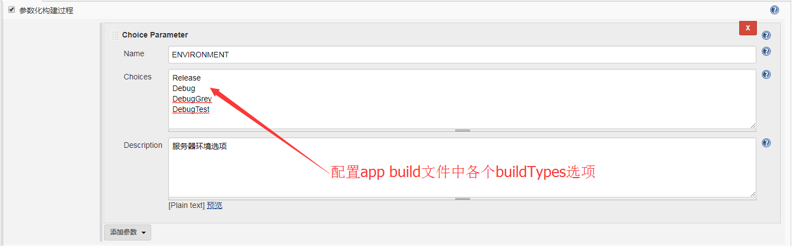
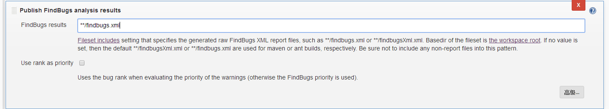

### Jenkins导入项目说明
版本 | 修订时间 | 修订人 | 备注
------|------|------|------
@v1.0.0 | 2017-11-30 | 晁永兵 |

#### 1.浏览器访问：http://jenkins.zhuolipu.com:8080/ 不需要账号密码，直达主界面

#### 2.切换至“Android-Develop”菜单，点击左上方“新建”按钮

#### 3.输入项目名称，选择“构建一个自由风格的软件项目”，点击“ok”创建项目

#### 4.General设置
##### 填写项目说明，配置buildTypes，每个buildType可对应一个服务器环境：

##### 配置git参数：

##### 最终配置结果：

##### 若有其他自定义参数也可相应配置进去

#### 5.源码管理

#### 6.构建触发器

#### 7.构建环境
##### 这一步是配置构建名称，为可选项，勾选之后输入自定义名称即可
    #${BUILD_NUMBER}_${GIT_BRANCH}_${ENVIRONMENT}

#### 8.构建

##### 脚本解释：
    --continue clean checkStyle lint'${ENVIRONMENT}' test'${ENVIRONMENT}'UnitTest assemble'${ENVIRONMENT}'
- --continue : 中间出现错误继续执行下一个 task
- clean:清除build文件夹
- checkStyle：执行checkStyle检查，并生成报告
- lint'${ENVIRONMENT}'：根据选择的参数执行lint检查，`经测试，这个过程中在gradle-4.1中会自动打包相应环境的apk，在gradle-2.14.1中是不会的`
- test'${ENVIRONMENT}'UnitTest：执行相应环境的单元测试，并生成报告。`单元测试中若使用了Robolectric框架，则需要在build文件下有清单文件和一些资源`
- `assemble'${ENVIRONMENT}'：参照lint的说明，这一项有时候是可以没有的，不过加上最为保险，经测试在gradle-4.1加上之后不加相比整个过程花费时间多了不到10s`

`注：与'${ENVIRONMENT}'类似，若在参数化构建中设置了productFlavors，拼接方法一致，具体可参见task拼接规则，如果productFlavors命名为PRODUCTFLAVOR，形式如`

    --continue clean checkStyle lint'${PRODUCTFLAVOR}''${ENVIRONMENT}' test'${PRODUCTFLAVOR}''${ENVIRONMENT}'UnitTest assemble'${ENVIRONMENT}'

#### 另外再添加一项gradle脚本，配置findBugs task，如下：

- findbugs:执行findbugs检查，并生成报告。`findbugs分析的是class或者jar文件，故需要在生成class之后执行`

#### 9.构建后操作，分别添加如下配置
#### * Publish Android Lint results

Lint files : `/lint-results.xml`,这是lint默认设置不填写也可以
在app的build文件中“android”节点下添加配置：

    lintOptions {
        abortOnError false
    }

#### * Publish Checkstyle analysis results

Checkstyle results：`/checkstyle-result.xml`,这是chekcstyle的默认设置不填写也可以
在app的build文件中添加apply 和如下任务：

	apply plugin: 'checkstyle'//添加Plugin
	
	task checkStyle(type: Checkstyle) {
	    source 'src'
	    configFile file("${project.rootDir}/app/config/checkstyle.xml") // 配置样式
	    include '**/*.java'
	    exclude '**/gen/**'
	    classpath = files()
	    ignoreFailures true // 配置是否忽略失败
	    // 自定义报告生成路径
	    reports {
	        html {
	            destination "${project.rootDir}/app/build/reports/checkstyle/checkstyle-result.html"
	        }
	        xml {
	            destination "${project.rootDir}/app/build/reports/checkstyle/checkstyle-result.xml"
	        }
	    }
	}
	tasks.withType(Checkstyle).each { checkstyleTask ->
	    checkstyleTask.doLast {
	        reports.all { report ->
	            // 检查生成报告中是否有错误
	            def outputFile = report.destination
	            if (outputFile.exists() && outputFile.text.contains("<error ") && !checkstyleTask.ignoreFailures) {
	                throw new GradleException("There were checkstyle errors! For more info check $outputFile")
	            }
	        }
	    }
	}
其中checkstyle.xml文件是代码检查的规范，我这里的模板是这样子的：
	
	<?xml version="1.0"?>
	<!DOCTYPE module PUBLIC  "-//Puppy Crawl//DTD Check Configuration 1.2//EN"
	    "http://www.puppycrawl.com/dtds/configuration_1_2.dtd">

	<module name="Checker">

    <!-- 检查文件是否以一个新行结束-->
    <module name="NewlineAtEndOfFile"/>

    <!-- 检查文件中是否含有tab键-->
    <module name="FileTabCharacter"/>

    <!-- 抑制警告 -->
    <module name="SuppressWarningsFilter"/>

    <!-- Checks for Size Violations.                    -->
    <!-- See http://checkstyle.sf.net/config_sizes.html -->
    <!-- 检查文件的长度 default max=2000 -->
    <module name="FileLength"/>

    <!--RegexpSingleline（正则表达式单行匹配）-->
    <!--检查单行是否匹配一条给定的正则表达式。可以处理任何文件类型。-->

    <!--解释：这项检查可以作为原型检查使用，能够发现常见的编码坏习惯，-->
    <!--例如调用ex.printStacktrace()、-->
    <!--System.out.println()、System.exit()，等等。 -->

    <!-- Trailing spaces -->
    <module name="RegexpSingleline">
        <property name="format" value="\s+$"/>
        <property name="message" value="Line has trailing spaces."/>
    </module>

    <!-- Space after 'for' and 'if' -->
    <module name="RegexpSingleline">
        <property name="format" value="^\s*(for|if)[^ ]\("/>
        <property name="message" value="Space needed before opening parenthesis."/>
    </module>

    <!-- For each spacing -->
    <module name="RegexpSingleline">
        <property name="format" value="^\s*for \(.*?([^ ]:|:[^ ])"/>
        <property name="message" value="Space needed around ':' character."/>
    </module>

    <module name="TreeWalker">

        <!-- 常量全部用大写-->
        <module name="ConstantName"/>

        <!-- 成员变量格式为: 驼峰-->

        <module name="MemberName">
            <property name="format" value="^[a-z][a-zA-Z0-9]*$"/>
        </module>

        <!-- 检查代码块:起始大括号和if等同行，不能有空的代码块，结束大括号另起一行-->
        <module name="LeftCurly"/>
        <module name="NeedBraces"/>
        <module name="RightCurly"/>
        <!-- 当有多重修饰符时,修饰符采用以下顺序:
             (public,protected,private,abstract,static,final,
             transient,volatile,synchronized,native,strictfp) -->
        <module name="ModifierOrder"/>

        <!-- 避免.*,重复多余的和不使用的import-->
        <module name="AvoidStarImport"/>
        <module name="RedundantImport"/>
        <module name="UnusedImports"/>

    </module>
</module>

#### * Publish FindBugs analysis results

Findbugs results：`**/findbugs.xml`,这是findbugs的默认设置，不填写也可以
在app的build文件中添加apply 和如下任务：

	apply plugin: 'findbugs'

	task findbugs(type: FindBugs) {
	    ignoreFailures = true
	    effort = "default"
	    reportLevel = "medium"
	    //过滤器
	    excludeFilter = new File("${project.rootDir}/findbugs/filter_exclude.xml")
	    includeFilter = new File("${project.rootDir}/findbugs/filter_include.xml")
	    //这里填写项目classes目录
	    classes = files("${project.rootDir}/app/build/intermediates/classes")
	    source = fileTree('src/main/java')
	    classpath = files()
	    reports {
	        //只能开启一个
	        xml.enabled = true
	        html.enabled = false
			//报告输出路径
	        xml {
	            destination "${project.rootDir}/app/build/reports/findbugs/findbugs.xml"
	        }
	        html {
	            destination "${project.rootDir}/app/build/reports/findbugs/findbugs.html"
	        }
	    }
	}

说明：filter_include.xml和filter_exclude.xml两个文件分别是加入和排除检查路径的配置，运维助手相关文件内容如下：

`filter_include.xml:`
		
		<?xml version="1.0" encoding="UTF-8"?>
		<FindBugsFilter>
		    <!--包过滤,可根据具体包名进行相应的修改-->
		    <Match>
		        <Package name="~com\.heyzhima\.yw.*"/>
		    </Match>
		    <Match>
		        <Package name="~com\.zhuolipu\.yunxin.*"/>
		    </Match>
		    <Match>
		        <Package name="~com\.zhuolipu\.websocket.*"/>
		    </Match>
		</FindBugsFilter>
	
`filter_exclude.xml :`

	<?xml version="1.0" encoding="UTF-8"?>
	<FindBugsFilter>
	    <Match>
	        <Class name="~.*\.R\$*[a-z]*"/>
	    </Match>
	    <Match>
	        <Class name="~.*\.Manifest\$*[a-z]*"/>
	    </Match>
	    <Match>
	        <Class name="~.*\.*Test"/>
	        <!-- test classes are suffixed by 'Test' -->
	        <Not>
	            <Bug code="IJU"/> <!-- 'IJU' is the code for bugs related to JUnit test code -->
	        </Not>
	    </Match>
	</FindBugsFilter>

#### * Publish JUnit test result report

#### * E-mail Notification
##### 填写邮箱即可，目前只测试了卓利普企业邮箱可以正常接收邮件

#### * Editable Email Notification
##### 输入收件人，多个收件人时使用英文“,”隔开即可，然后编写自定义邮件内容：

##### 在“高级”选项中可以选择触发邮件的规则，设置收件人：

##### 以上步骤配置完毕，点击左下方“保存”按钮即可，邮件模板如下：

    <!DOCTYPE html>
    <html>
    <head>
    <meta charset="UTF-8">
    <title>${ENV, var="JOB_NAME"}-第${BUILD_NUMBER}次构建日志</title>
    </head>

    <body leftmargin="8" marginwidth="0" topmargin="8" marginheight="4"
        offset="0">
        <table width="95%" cellpadding="0" cellspacing="0"
            style="font-size: 11pt; font-family: Tahoma, Arial, Helvetica, sans-serif">
            <tr>
                <td>(本邮件是程序自动下发的，请勿回复！)</td>
            </tr>
            <tr>
                <td><h2>
                        构建结果 - ${BUILD_STATUS}
                    </h2></td>
            </tr>
            <tr>
                <td> 
                <b>构建信息</b>
                
</td>
            </tr>
            <tr>
                <td>
                    <ul>
                        <li>项目名称 ： ${PROJECT_NAME}</li>
                        <li>构建编号 ： 第${BUILD_NUMBER}次构建</li>
                        <li>触发原因 ： ${CAUSE}</li>
                        <li>构建名称 ： #${BUILD_NUMBER}_${GIT_BRANCH}_${ENVIRONMENT}</li>
                        <li>gitlab分支 ： ${GIT_BRANCH}</li>
                        <li>gitlab地址 ：<a href="${GIT_URL}">${GIT_URL}</a></li>
                        <li>构建 URL： <a href="${BUILD_URL}">${BUILD_URL}</a></li>
                        <li>工作目录 ： <a href="${PROJECT_URL}ws">${PROJECT_URL}ws</a></li>
                        <li>单元测试报告： <a href = "${BUILD_URL}/testReport">单元测试报告</a></li>
                        <li>FindBugs： <a href = "${BUILD_URL}/findbugsResult">findbugs报告</a></li>
                        <li>Android lint： <a href = "${BUILD_URL}/androidLintResult">Android lint报告</a></li>
                        <li>CheckStyle： <a href = "${BUILD_URL}/checkstyleResult">CheckStyle报告</a></li>
                    </ul>
                </td>
            </tr>
            <tr>
                <td><b>构建项目描述</b>
                
</td>
            </tr>
            <tr>
                <td><pre
                        style="font-size: 11pt; font-family: Tahoma, Arial, Helvetica, sans-serif">${JOB_DESCRIPTION}</pre>
                     </td>
            </tr>
            <tr>
                <td><b>失败的测试结果</b>
                
</td>
            </tr>
            <tr>
                <td><pre
                        style="font-size: 11pt; font-family: Tahoma, Arial, Helvetica, sans-serif">${FAILED_TESTS}</pre>
                     </td>
            </tr>
            <tr>
                <td><pre
                        style="font-size: 11pt; font-family: Tahoma, Arial, Helvetica, sans-serif">具体请查看附件build.log</pre>
                 </td>
            </tr>
        </table>
    </body>
    </html>

##### 还可以在邮件附件中添加生成的apk和log日志：

    **/outputs/apk/**/*.apk

`注：不同gradle版本编译出来的apk存放的位置可能不太一样，若上面的规则匹配不到文件，可相应地做出修改`

#### 10.回到首页，进入刚配置的项目，按照如下步骤进行构建

#### 11.一切正常的话会收到报告的邮件，右侧会出现lint等的统计情况。

#### 12.邮件内容如下，点击链接可以直达报告

##### 单元测试报告

##### FindBugs报告

##### Lint报告

##### CheckStyle报告

##### 注：其实对于项目的这些配置都存放在了一个叫做config.xml的文件中，如果想偷懒的话可以直接将运维助手的相关配置直接拷贝到自己项目下进行覆盖，使jenkins重新读取一下设置信息，然后修改个别配置比如git地址、项目名称等即可，非常方便而且不容易出错,具体的配置文件的路径为/var/jenkins/jobs/yourprojname/config.xml。