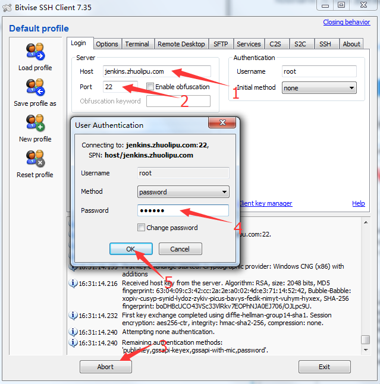
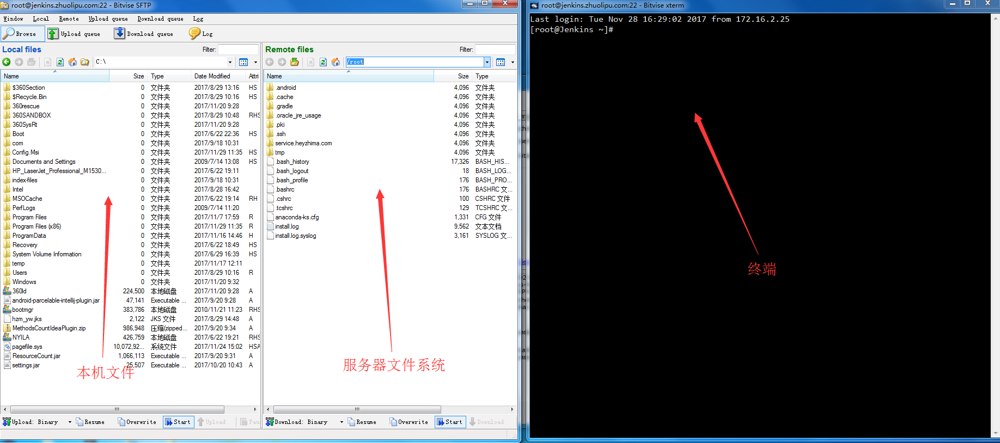
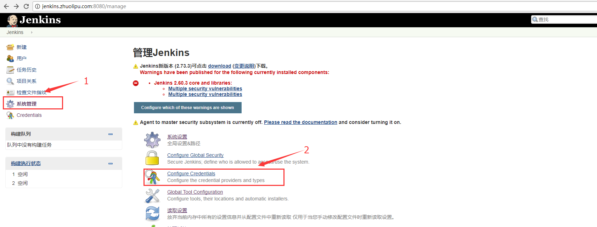
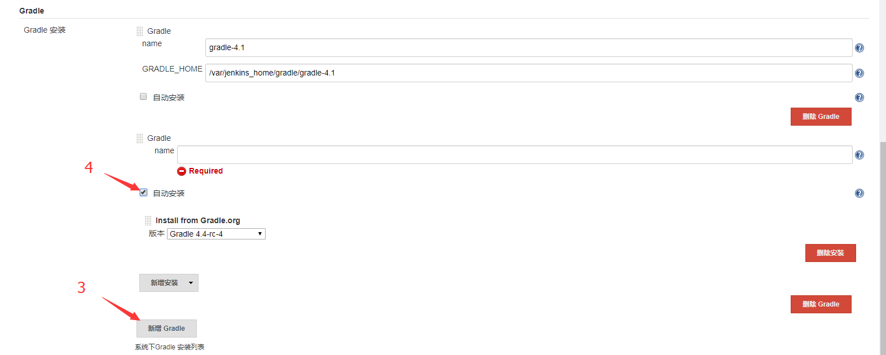
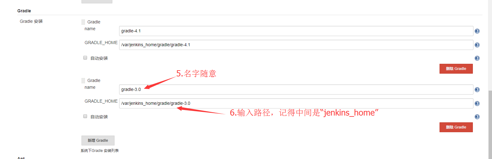
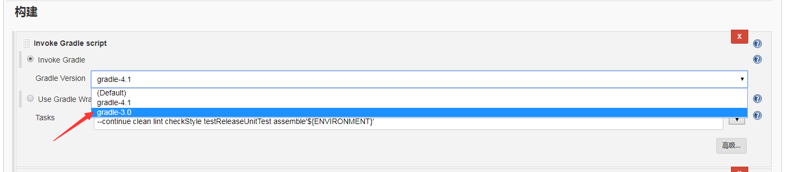

# jenkins环境配置说明

版本 | 修订时间 | 修订人 | 备注
------|------|------|------
V1.0.0 | 2017-11-29 | 晁永兵 | 初稿

### 1. 连接至Linux服务器

---

##### jenkins服务器
- Host：jenkins.zhuolipu.com
- Port：22
- password：123456

##### Mac 
1. 打开终端
2. 在打开的终端页面，输入如下代码：
	ssh user@hostname
	注：
	user 为 linux 服务器的管理员名称
	 hostname 为 linux 服务器的IP
##### windows
1. 点击连接https://www.bitvise.com/ssh-client-download 下载安装 Bitvise SSH Client客户端
2. 连接至服务器：

    

    连接成功之后即可看到以下两个界面：

    

    `说明:jenkins安装在docker镜像中，镜像中的/var/jenkins_home文件路径映射了服务器本身的/var/jenkins路径，故以下我们配置的路径中如果包含了/var/jenkins_home则实际上是指向/var/jenkins的，这一点是配置的基石。`

### 2. 配置gradle

---

1. 在终端通过cd命令将当前路径切换至/var/jenkins/gradle
2. 在官网https://gradle.org/releases/ 找到需要的gradle版本下载地址
3. 这里以3.0-all为例，在终端使用wget命令下载文件:

        wget https://services.gradle.org/distributions/gradle-3.0-all.zip
    `注：如果下载速度难以恭维的话，也可以使用迅雷下载zip包之后通过SFTP界面直接将文件拖拽至/var/jenkins/gradle目录下`
4. 等待下载完毕后，输入以下命令进行解压：

       unzip gradle-3.0-all.zip

    解压后得到gradle-3.0文件夹

5. 浏览器访问http://jenkins.zhuolipu.com:8080  依次选择：
系统管理  > Global Tool Configuration > Gradle 安装 > 新增Gradle > 取消选择“自动安装”

    
    

    填写name和path：

    

    最后点击左下角“Save”按钮保存即可，至此配置gradle 3.0完毕。

6. 在具体项目的“构建 > Gradle Version”中就可以看到刚刚配置的gradle3.0了：

    

